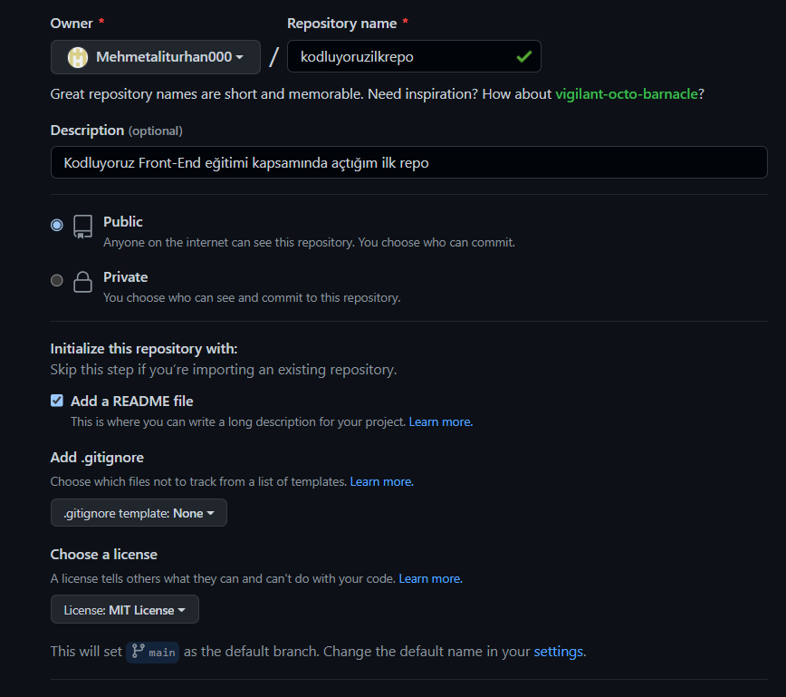

#Kodluyoruz İlk Repo
Bu repo Kodluyoruz Front-End eğitiminde oluşturdğumuz ilk repo. İçerisinde bir adet README dosyası, bir adet index.html barındırıyor.

#Installation
Öncelikle projeyi klonlayın. (Buraya sizin reponuzdan aldığınız link gelecek)

> git clone https://github.com/Mehmetaliturhan000/kodluyoruzilkrepo.git

#Usage
Projeyi cloneladıktan sonra Visual Studio Code programında açınız.

Linux için

>cd kodluyoruzilkrepo
code .

#Contribuiting 
Pull requestler kabul edilir. Büyük değişiklikler için, lütfen önce neyi değiştirmek istediğinizi tartışmak için bir konu açınız.

#License
My favorite search engine is [MIT](https://choosealicense.com/licenses/mit/).